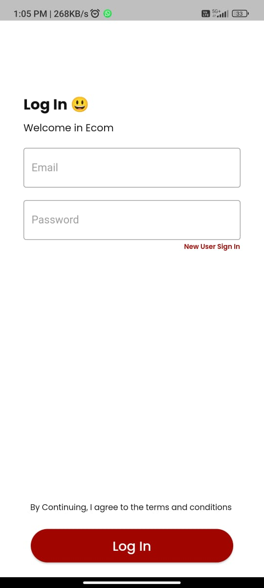

# Ecom Flutter app project.

In this project, I used the Stacked architecture, which is a lightweight MVVM-inspired architecture that promotes separation of concerns and reactive programming in Flutter apps.
Stacked implements separation of concerns and dependency injection by building Flutter code around 3 entities: Views, ViewModels, and Services.

<hr />

## API 
```bash
    https://fakestoreapi.com/products 
   ```

## Features
<hr />
1. 🔐 User Login: Allow users to securely log in to their accounts using their credentials.

2. ✏️ User Signup: Enable new users to create accounts by providing necessary information and registering securely.

3. 🔍 User Check Product: Allow users to browse through a wide range of products available in the app.

4. 🔄 Sort by Category: Provide users with the option to sort and filter products based on different categories for easy navigation.

5. 🛒 Add to Cart: Enable users to add desired products to their shopping cart for convenient and quick purchase.

6. 📦 Placed Order: Allow users to place orders for the selected products and proceed with the checkout process for finalizing the purchase.
<hr />

## ScreenShots
<hr />
<div style="display:flex; justify-content:center;">
    
    
    
</div>
<hr />
<div style="display:flex; justify-content:center;">
    
    
    
</div>
<hr />
<div style="display:flex; justify-content:center;">
    
    
</div>
<hr />
 


## Packages used:
<hr />
- google_fonts: Provides a way to easily use custom fonts from the Google Fonts library in Flutter apps.
<br>
- easy_widgets: A package that offers easy-to-use widgets for common UI components in Flutter apps.
<br>
- flutter_screenutil: Helps to make responsive UI designs by adapting UI elements to different screen sizes and resolutions.
<br>
- stacked: A package that provides architecture components for implementing the MVVM pattern in Flutter apps.
<br>
- stacked_services: Offers a set of services for navigation, dialog, and bottom sheet management in Stacked architecture.
<br>
- auto_route: A Flutter navigation package that generates route helpers and provides strongly-typed routing and deep linking.
<br>
- stacked_generator: Code generation package for the Stacked architecture to streamline development.
<br>
- injectable: A package for dependency injection in Dart and Flutter apps, making it easier to manage dependencies and decouple components.
<br>
- intl: Provides internationalization and localization support for Flutter apps.
<br>
- build_runner: A tool that helps to generate code for projects that use package:build.
<br>
- provider: A state management package that provides a simple way to manage app state and update UI components accordingly.
<br>
- firebase_auth: Provides Firebase authentication services for Flutter apps.
<br>
- firebase_core: Required for using Firebase services in Flutter apps.
<br>
- dio: A powerful HTTP client for Flutter and Dart, providing support for interceptors, FormData, request cancellation, and more.
<br>
<hr />

## How to Run the Flutter App

To run this Flutter app, follow these steps:

1. **Setup Flutter Environment:** Ensure you have Flutter installed on your system. If not, follow the official Flutter installation guide: [Flutter Installation Guide](https://flutter.dev/docs/get-started/install).

2. **Clone the Repository:** Clone this repository to your local machine using Git:
   ```bash
   git clone <repository-url>
   ```
3. Navigate to Project Directory: Change your current directory to the project directory:
   ```bash
    cd <project-directory>  
   ``` 
   
4. Install Dependencies: Run the following command to install project dependencies:
   ```bash
   flutter pub get
   ```
5. Run the App: Use the following command to run the Flutter app on your connected device or emulator:
  ```bash
     flutter run
```

